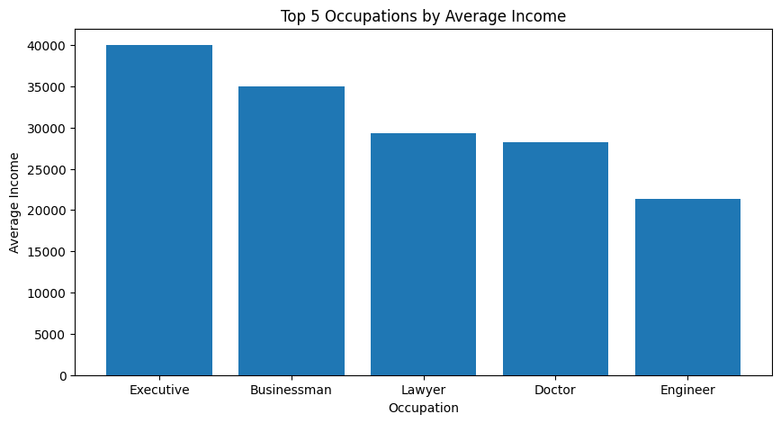
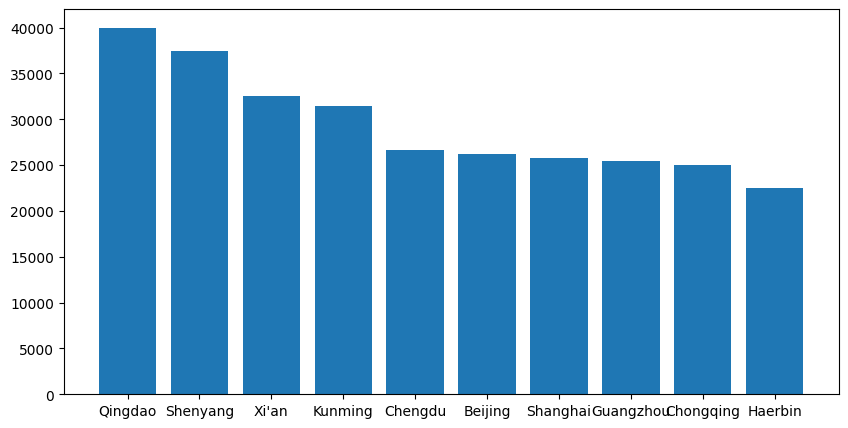
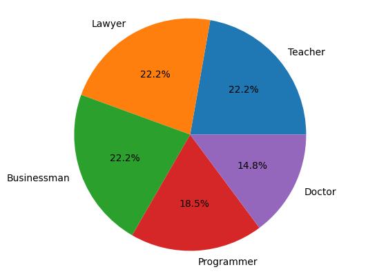

```python
from dotenv import load_dotenv

load_dotenv(override=True)
```


    True


```python
import pandas as pd

data = pd.read_csv("data.csv")
data.head()
```


<div>
<style scoped>
    .dataframe tbody tr th:only-of-type {
        vertical-align: middle;
    }

    .dataframe tbody tr th {
        vertical-align: top;
    }

    .dataframe thead th {
        text-align: right;
    }
</style>
<table border="1" class="dataframe">
  <thead>
    <tr style="text-align: right;">
      <th></th>
      <th>Name</th>
      <th>Age</th>
      <th>Gender</th>
      <th>City</th>
      <th>Occupation</th>
      <th>Income</th>
    </tr>
  </thead>
  <tbody>
    <tr>
      <th>0</th>
      <td>Wang Lei</td>
      <td>32</td>
      <td>Male</td>
      <td>Beijing</td>
      <td>Teacher</td>
      <td>10000</td>
    </tr>
    <tr>
      <th>1</th>
      <td>Li Wei Jia</td>
      <td>23</td>
      <td>Female</td>
      <td>Shanghai</td>
      <td>Doctor</td>
      <td>20000</td>
    </tr>
    <tr>
      <th>2</th>
      <td>Zheng Xiao Gang</td>
      <td>45</td>
      <td>Male</td>
      <td>Guangzhou</td>
      <td>Policeman</td>
      <td>10000</td>
    </tr>
    <tr>
      <th>3</th>
      <td>Huang Xiao Ning</td>
      <td>28</td>
      <td>Male</td>
      <td>Shenzhen</td>
      <td>Programmer</td>
      <td>15000</td>
    </tr>
    <tr>
      <th>4</th>
      <td>He Li Na</td>
      <td>35</td>
      <td>Female</td>
      <td>Chengdu</td>
      <td>Lawyer</td>
      <td>25000</td>
    </tr>
  </tbody>
</table>
</div>


```python
import os
from langchain_groq.chat_models import ChatGroq

llm = ChatGroq(
    model_name="mixtral-8x7b-32768",
    api_key=os.environ["GROQ_API_KEY"],
)
```


```python
from pandasai import SmartDataframe

df = SmartDataframe(data, config={"llm": llm})
```

平均收入排名前五的城市是哪些?


```python
df.chat("What are the top 5 cities for average income?")
```


<div>
<style scoped>
    .dataframe tbody tr th:only-of-type {
        vertical-align: middle;
    }

    .dataframe tbody tr th {
        vertical-align: top;
    }

    .dataframe thead th {
        text-align: right;
    }
</style>
<table border="1" class="dataframe">
  <thead>
    <tr style="text-align: right;">
      <th></th>
      <th>Income</th>
    </tr>
    <tr>
      <th>City</th>
      <th></th>
    </tr>
  </thead>
  <tbody>
    <tr>
      <th>Qingdao</th>
      <td>40000.0</td>
    </tr>
    <tr>
      <th>Shenyang</th>
      <td>37500.0</td>
    </tr>
    <tr>
      <th>Xi'an</th>
      <td>32500.0</td>
    </tr>
    <tr>
      <th>Kunming</th>
      <td>31500.0</td>
    </tr>
    <tr>
      <th>Chengdu</th>
      <td>26600.0</td>
    </tr>
  </tbody>
</table>
</div>


计算每个职业的平均收入，然后将前5个职业从高到低排序


```python
df.chat(
    "Calculate the average income for each occupation and then rank the top 5 occupations from highest to lowest"
)
```

    <string>:2: FutureWarning: The default value of numeric_only in DataFrameGroupBy.mean is deprecated. In a future version, numeric_only will default to False. Either specify numeric_only or select only columns which should be valid for the function.


    '/Users/chi/Desktop/quartz/content/study/exports/charts/temp_chart.png'


    

    


首先，按平均收入从高到低对城市进行排序，然后创建一个条形图，显示平均收入排名前10位的城市


```python
df.chat(
    "First, sort the cities by average income from high to low, then create a bar chart displaying the top 10 cities by average income"
)
```


    '/Users/chi/Desktop/quartz/content/study/exports/charts/temp_chart.png'


    

    


首先，计算每个职业的人数，然后根据人数创建一个饼状图，列出前5个职业


```python
df.chat(
    "First, calculate the number of people in each occupation, and then create a pie chart for the top 5 occupations by count"
)
```


    '/Users/chi/Desktop/quartz/content/study/exports/charts/temp_chart.png'


    

    

